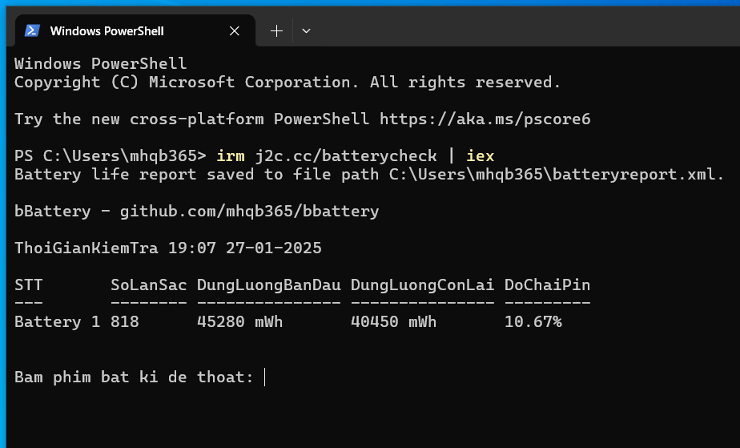

# Kiểm tra nhanh độ chai pin của máy tính Windows 🔋

Script này sử dụng công cụ powercfg mặt định của Windows để xuất file report ra định dạng xml rồi tách lấy dữ liệu để tính toán sau đó hiển thị thông số pin ngay trên giao diện dòng lệnh. Giúp rút ngắn thời gian kiểm tra và chỉ hiển thị thông tin cần thiết cũng như không cần cài thêm ứng dụng bên thứ 3 rườm rà

Lệnh irm sử dụng công cụ rút gọn link của J2TEAM làm trung gian trỏ thẳng đến script ngay trên repo github này, nếu còn vấn đề bảo mật thì tui cũng bó tay

## Cách dùng

Copy dòng lệnh dưới đây, paste vào PowerShell hoặc Terminal sau đó Enter và xem kết quả

```sh
irm j2c.cc/batterycheck | iex
```

Hoặc copy dòng lệnh này, paste vào Command Prompt rồi Enter và xem kết quả

```sh
powershell iex (irm j2c.cc/batterycheck)
```

Kết quả



Giải thích

```STT```: số thứ tự pin, vài trường hợp đặt biệt máy tính có từ 2 pin (Surface Book, Lenovo T480, v.v..)

```SoLanSac```: số lần sạc / chu kỳ sạc (Cycle Count)

```DungLuongBanDau```: dung lượng ban đầu của pin (Design Capacity)

```DungLuongConLai```: dung lượng hiện tại mà pin lưu trữ được khi sạc đầy (Full Charge Capacity)

```DoChaiPin```: độ chai của pin (Battery Wear Level)

Lưu ý: các thông số hiển thị chịu ảnh hưởng bởi các yếu tố phần cứng (bo mạch máy tính & ROM pin). Với tui thì các thông số trên chỉ mang tính tham khảo, tui thường nhìn vào thời gian sử dụng được sau khi sạc đầy để đánh giá pin. GoodLuck!

Made with Love ❤️
